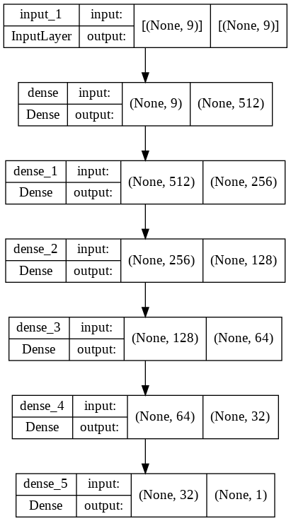
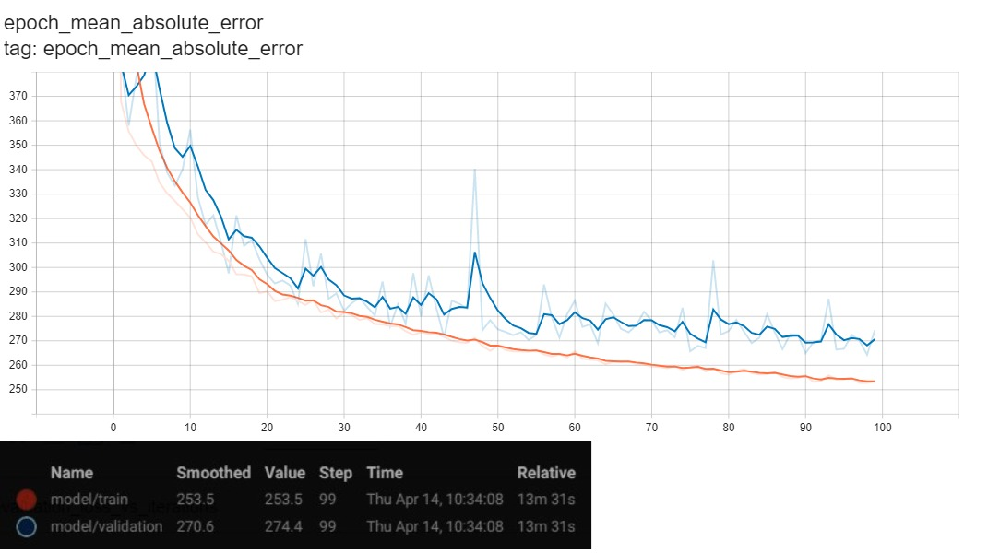

# Diamond Price Prediction <a href="https://htmlpreview.github.io/?https://raw.githubusercontent.com/SarahHannes/diamond-price-prediction/main/diamond_price_prediction.html">[Code]</a>

Predict diamond price using simple feedforward neural network. Data is obtained from <a href="https://www.kaggle.com/datasets/shivam2503/diamonds">Kaggle</a>. Model training is performed on Google Colab without GPU runtime. Each epoch run for approx 5s.

## Methodology
## Data Preprocessing
- All categorical features were transformed into numerical using OrdinalEncoder from Sklearn
- Feature normalization was applied on all feature columns using RobustScaler from Sklearn
- Data is split into Train (75%), Validation (15%), Test (10%)

## Model Architecture

- Input layer + 5 Dense hidden layers + 1 Dense output layer
- Trained for 100 epochs
- Last validation mean absolute error is 265.9

